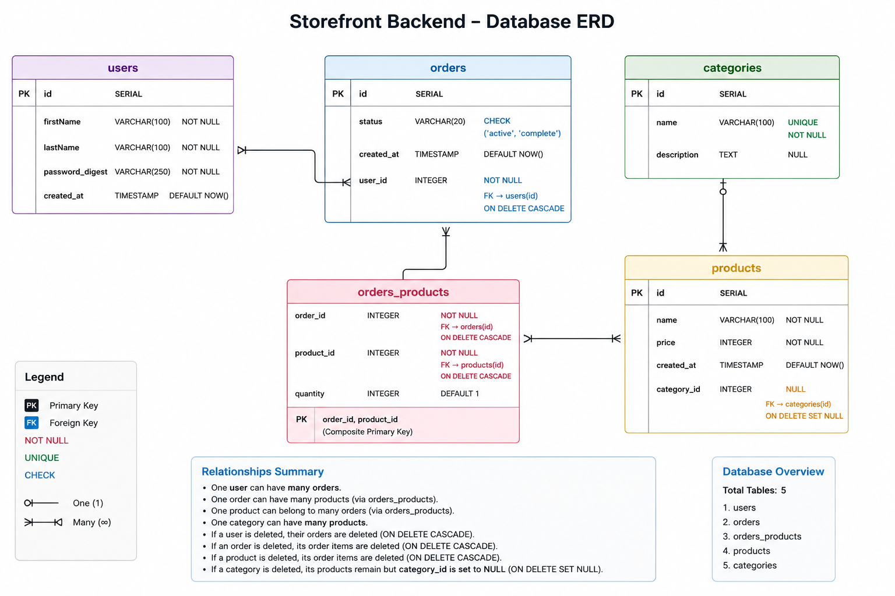

# Storefront Backend Project --- REQUIREMENTS.md

The storefront backend API provides a RESTful system for managing
products, users, categories, and orders using PostgreSQL and JWT
authentication.

------------------------------------------------------------------------

# 1. API ENDPOINTS (RESTful Routes)

## Root Endpoint

  Method   Route   Description
  -------- ------- ---------------
  GET      `/`     Welcome route

------------------------------------------------------------------------

## Products

  Method   Route                        Description                  Token Required
  -------- ---------------------------- ---------------------------- ----------------
  GET      `/products`                  Get all products             No
  GET      `/products/:id`              Get product by ID            No
  GET      `/products/top`              Get top 5 popular products   No
  GET      `/products/category/:name`   Get products by category     No
  POST     `/products`                  Create new product           Yes
  PUT      `/products/:id`              Update product               Yes
  DELETE   `/products/:id`              Delete product               Yes

------------------------------------------------------------------------

## Categories

  Method   Route               Description          Token Required
  -------- ------------------- -------------------- ----------------
  GET      `/categories`       Get all categories   No
  GET      `/categories/:id`   Get category by ID   No
  POST     `/categories`       Create category      Yes
  PUT      `/categories/:id`   Update category      Yes
  DELETE   `/categories/:id`   Delete category      Yes

------------------------------------------------------------------------

## Users

  Method   Route          Description                 Token Required
  -------- -------------- --------------------------- ----------------
  GET      `/users`       Get all users               Yes
  GET      `/users/:id`   Get user by ID              Yes
  POST     `/users`       Create user (returns JWT)   No
  PUT      `/users/:id`   Update user                 Yes
  DELETE   `/users/:id`   Delete user                 Yes

------------------------------------------------------------------------

## Orders

  -------------------------------------------------------------------------------------------
  Method        Route                         Description           Token Required
  ------------- ----------------------------- --------------------- -------------------------
  GET           `/orders`                     Get all orders        Yes

  GET           `/orders/current/:userId`     Get active orders for Yes
                                              a user                

  GET           `/orders/completed/:userId`   Get completed orders  Yes
                                              for a user            
  -------------------------------------------------------------------------------------------

------------------------------------------------------------------------

# 2. DATA SHAPES

## Category

``` json
{
  "id": 1,
  "name": "Electronics",
  "description": "Electronic devices and accessories"
}
```

## Product

``` json
{
  "id": 1,
  "name": "iPhone 15",
  "price": 1200,
  "category": "Electronics"
}
```

## User

``` json
{
  "id": 1,
  "firstName": "John",
  "lastName": "Doe"
}
```

## Order

``` json
{
  "id": 1,
  "status": "active",
  "user_id": 1,
  "full_name": "John Doe",
  "products": [
    {
      "id": 1,
      "name": "iPhone 15",
      "price": 1200,
      "quantity": 2
    }
  ]
}
```

------------------------------------------------------------------------

# 3. DATABASE SCHEMA (PostgreSQL)

## Users

-   id SERIAL PRIMARY KEY
-   first_name VARCHAR(100) NOT NULL
-   last_name VARCHAR(100) NOT NULL
-   password VARCHAR(255) NOT NULL (hashed)

## Categories

-   id SERIAL PRIMARY KEY
-   name VARCHAR(100) NOT NULL
-   description TEXT NULL

## Products

-   id SERIAL PRIMARY KEY
-   name VARCHAR(150) NOT NULL
-   price NUMERIC(10,2) NOT NULL
-   category_id INTEGER REFERENCES categories(id)

## Orders

-   id SERIAL PRIMARY KEY
-   status VARCHAR(50) NOT NULL
-   user_id INTEGER REFERENCES users(id)

## Orders_Products

-   id SERIAL PRIMARY KEY
-   order_id INTEGER REFERENCES orders(id)
-   product_id INTEGER REFERENCES products(id)
-   quantity INTEGER NOT NULL

------------------------------------------------------------------------

# Relationships

-   Users → Orders (1:M)
-   Categories → Products (1:M)
-   Orders ↔ Products (M:M via orders_products)

---

# Entity Relationship Diagram (ERD)

The database structure is represented in the ER diagram below:

